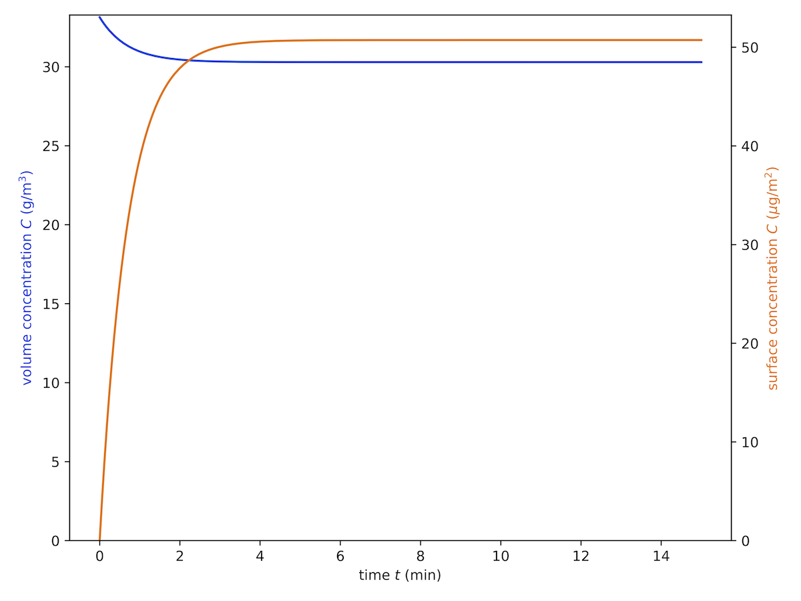

Adsorption - Desorption equilibrium
-----------------------------------

In this first example, the goal is to simulate a system reaching equilibrium in the dark.
To run the simulation, we are going to create a configuration file for :program:`pdom` first.
After calling :program:`pdom.config` we need to answer a few questions.
The parts which require user input are highlighted in yellow.

.. literalinclude:: examples/ads_des/pdom.config.flow.txt
   :emphasize-lines: 2, 7, 13, 18, 19, 24, 28, 32, 36, 40, 44, 48, 52
   :language: shell-session

The resulting file :download:`example_ads_des.ini <examples/ads_des/example_ads_des.ini>` is now in your working directory.
To start the simulation simply call :program:`pdom`:

.. code-block:: shell-session

    $ pdom example_ads_des.ini
    Start calculating single species model
    Calculation finished!
    Results saved in <your_working_dir>/example_ads_des

In the newly created folder :file:`{<your_working_dir>}/example_ads_des`, you find the raw data files with corresponding units and a :download:`plot <examples/ads_des/single_species.pdf>` of the concentration development over time.

