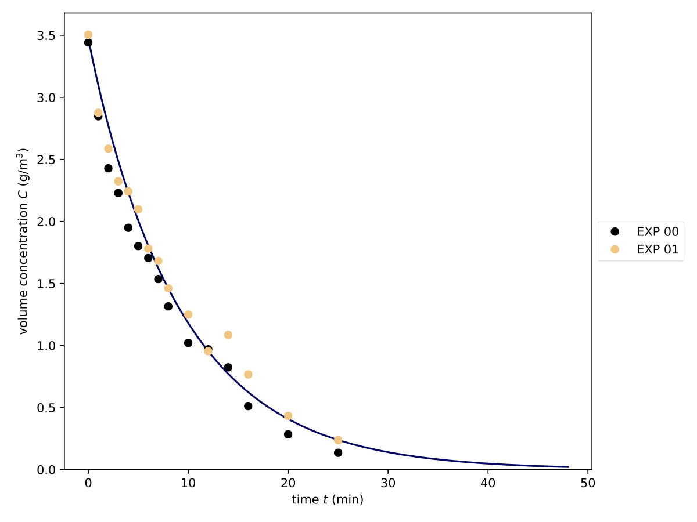

.. _ref_ex_reac_fit:

Degradation fit
---------------

Using the *single species* model, we fit in this example the reaction constant :math:`k_{\mathrm{reac}}` to experimental data.
With :program:`pdom.config` we can create :file:`example_reac_fit.ini`.
The parts which require user input are highlighted in yellow.

.. literalinclude:: examples/fit_reac/pdom.config.flow.txt
   :emphasize-lines: 2, 7, 13, 18, 19, 24, 28, 32, 36, 41, 45, 49
   :language: shell-session

The resulting file :download:`example_reac_fit.ini <examples/fit_reac/example_reac_fit.ini>` is now in your working directory.
Next, the experimental data needs to be stored as :download:`example_reac_fit.json <examples/fit_reac/example_reac_fit.json>`.
In this example, two time series with the same initial concentrations are used.

.. literalinclude:: examples/fit_reac/example_reac_fit.json
   :language: json
   :caption: example_reac_fit.json

With both files prepared :program:`pdom` can be started.

.. code-block:: shell-session

    $ pdom example_reac_fit.ini --data example_reac_fit.json
    Start fitting to data from reaction experiment.
    Fit finished after 24 iterations.
        k_ads: 3.700E-08 m/s
        k_des: 1.000E-03 1/s
        k_reac: 7.999E-03 1/s
        error: 2.964E+00
    Results saved in <your_working_dir>/example_reac_fit

The result of the fit is stored under :file:`{<your_working_dir>}/example_reac_fit/fit_single.json`.

.. literalinclude:: examples/fit_reac/fit_single.json
   :language: json
   :caption: <your_working_dir>/example_fit_reac/fit_single.json

In the same folder, you find the raw data files with corresponding units.
The saved :download:`plot <examples/fit_reac/fit_single.pdf>` shows the concentration development over time compared to the experimental results.

