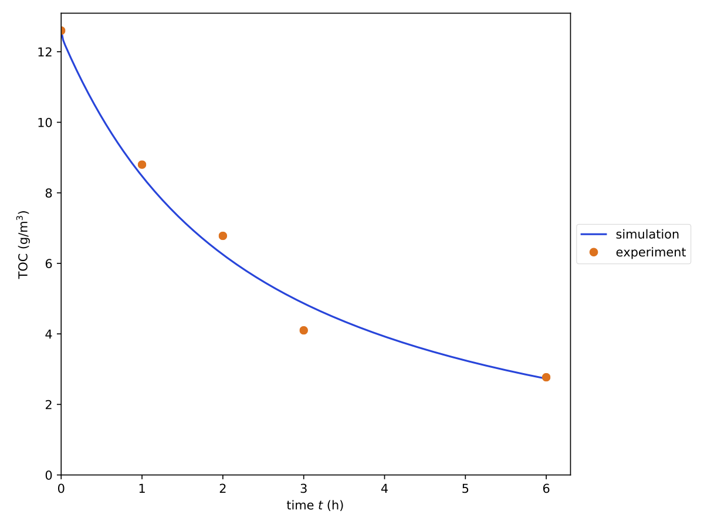

.. _ref_ex_toc_fit:

TOC fit
-------

To fit TOC data with :program:`pdom`, one of the *multi-species* models must be selected:

   * incremental
   * fragmentation
   * excess bonds

For this example, we will use *incremental*.
The model for the desorption constant :math:`k_{\mathrm{ads}}` is always *weak* when a TOC experiment is fitted.

The generation of the config file :download:`example_toc_fit.ini <examples/toc_fit/example_toc_fit.ini>` is again carried out with :program:`pdom.config`.
Lines with require user input are highlighted in yellow.

.. literalinclude:: examples/toc_fit/pdom.config.flow.txt
   :emphasize-lines: 2, 7, 13, 18, 19, 24, 28, 32, 36, 42, 47, 52, 56, 60, 64, 68
   :language: shell-session

After the config is generated, the experimental :download:`data set <examples/toc_fit/example_toc_fit.json>` is created.
In this example values published by Houas (2001) :cite:`Houas2001` will be used.

.. literalinclude:: examples/toc_fit/example_toc_fit.json
   :language: json
   :caption: example_reac_fit.json

With both files prepared :program:`pdom` can be started.

.. code-block:: shell-session

    $ pdom example_toc_fit.ini --data example_toc_fit.json
    Start fitting to toc
       Iteration     Total nfev        Cost      Cost reduction    Step norm     Optimality
           0              1         1.6916e-02                                    2.91e+00
           1              2         3.2468e-03      1.37e-02       9.48e-02       4.27e-01
           2              3         2.4751e-03      7.72e-04       3.53e-02       2.80e-02
           3              4         2.4706e-03      4.44e-06       3.08e-03       3.05e-04
           4              5         2.4706e-03      4.67e-10       3.43e-05       2.49e-05
           5              6         2.4706e-03      0.00e+00       0.00e+00       2.49e-05
    `xtol` termination condition is satisfied.
    Function evaluations 6, initial cost 1.6916e-02, final cost 2.4706e-03, first-order optimality 2.49e-05.
    Fit finished
        k_ads: 3.000E-09 m/s
        k_des: 6.800E-03 1/s
        k_reac: 6.800E-02 1/s
        beta_0: -7.781E-03 1/s
        beta_1: 2.333E-01 1/s
        error: 3.680E-02
    Results saved in <your_working_dir>/example_toc_fit

The result of the fit is stored under :file:`{<your_working_dir>}/example_toc_fit/fit_toc.json`.

.. literalinclude:: examples/toc_fit/fit_toc.json
   :language: json
   :caption: <your_working_dir>/example_toc_fit/fit_toc.json

In the same folder, you find the raw data files with corresponding units.
The saved :download:`plot <examples/toc_fit/fit_toc.pdf>` shows the TOC development over time compared to the experimental results.

