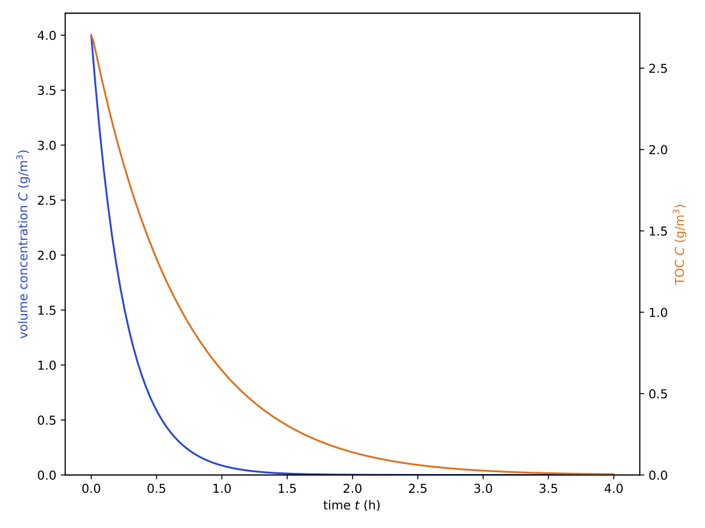
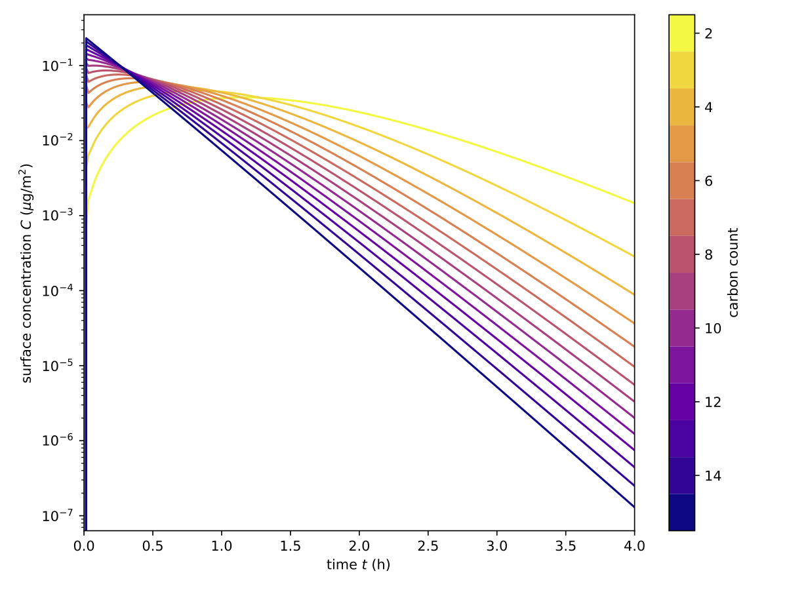

TOC simulation
--------------

Fragmentation
+++++++++++++

When the overall degradation of an organic molecule should be simulated, one of the *multi-species* models must be used.
Three different split models are available in :program:`pdom`:

   * incremental
   * fragmentation
   * excess bonds

To model the generalized split species, the size dependents of the desorption constant :math:`k_{\mathrm{ads}}` must be described.
You can either choose the *strong* or *weak* dependents for your simulation.
Due to the fewer variables, we chose, in this case, a *weak* dependents.

As before the config file :download:`example_toc_sim.ini <examples/toc/example_toc_sim.ini>` can be generated with :program:`pdom.config`.
Lines with require user input are highlighted in yellow.

.. literalinclude:: examples/toc/pdom.config.flow.txt
   :emphasize-lines: 2, 7, 13, 18, 19, 24, 28, 32, 36, 42, 47, 53, 57, 61, 65, 69, 73
   :language: shell-session

With the generated config :file:`example_toc_sim.ini` we can start the simulation with :program:`pdom`.

.. code-block:: shell-session

    $ pdom example_toc_sim.ini
    Start calculating multi species model
    Calculation finished!
    Results saved in <your_working_dir>/example_toc_sim

In the folder :file:`{<your_working_dir>}/example_toc_sim`, you find the raw data files with corresponding units and three plots.
The first plot is an :download:`overview <examples/toc/frag/c_volume-toc.pdf>` with TOC and the concentration of the initial molecule in solution.
The other two show concentration developments of the segments in :download:`solution <examples/toc/frag/volume_segments.pdf>` and on the :download:`surface <examples/toc/frag/surface_segments.pdf>`.

   Development of the concentration in solution and the total organic carbon (TOC) using *fragmentation* split model.

   Development of the segments in solution when using the *fragmentation* split model.

   Development of the segments on the surface when using the *fragmentation* split model.

Incremental
+++++++++++

Because :program:`pdom` is based on configuration files, you can simply make a copy of :file:`example_toc_sim.ini` and change the settings quickly for a new simulation.
You can alter the ``split_model`` key in the section ``MULTI`` to *incremental* for example:

.. code-block:: ini

    ...
    [MULTI]
    split_model = incremental
    desorption_model = weak
    ...

This would generate the following results:

   Development of the concentration in solution and the total organic carbon (TOC) using *incremental* split model.

   Development of the segments in solution when using the *incremental* split model.

   Development of the segments on the surface when using the *incremental* split model.